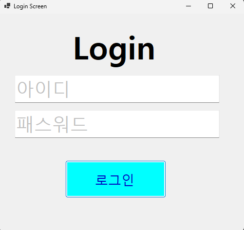
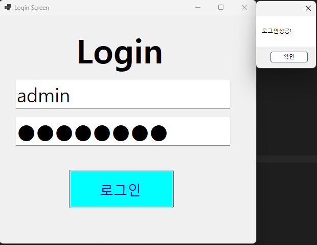
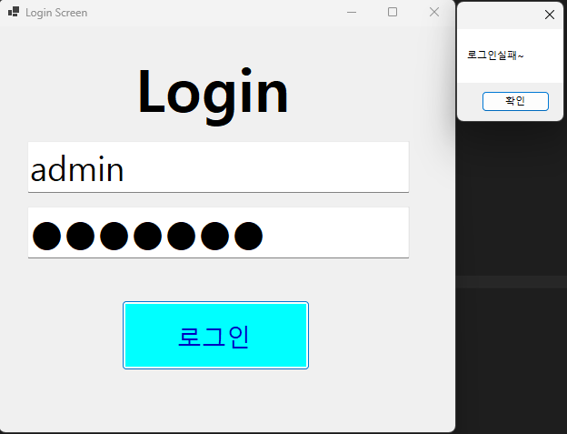
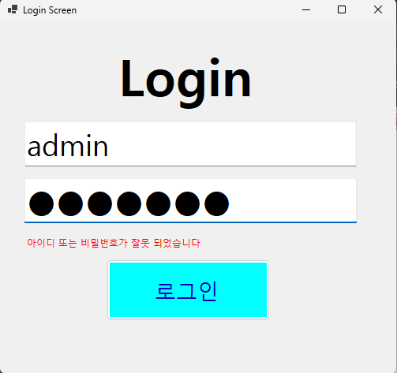

# (C# 코딩) 로그인 스크린
## 개요
-C# 프로그래밍학습
-1줄소개: 사용자키보드입력을받아서아이디,패스워드가 맞아야 로그인성공,아니면실패메시지출력하는로그인화면구현
-사용한플랫폼: -C#, .NET Windows Forms, Visual Studio, GitHub
-사용한컨트롤:-Label, TextBox, ListBox, Button
-사용한기술과구현한기능:
-Visual Studio를이용하여UI 디자인
-string 클래스를이용한사용자입력데이터처리
-컨트롤배치와기본적인속성설정
-Placeholder로입력창안내하는기능구현
-아이디와패스워드처리기능구현

## 실행화면(과제1)
-과제1코드의실행스크린샷
-과제1코드의실행스크린샷
-과제1코드의실행스크린샷

-과제내용
-UI 구성
-Placeholder표시
-로그인 가능여부 체크기능
-로그인 성공/실패 메시지 박스 보여주기

-구현내용과기능설명
-TextBox(아이디, 패스워드), Button(로그인) 등을 적절히 배치합니다.
-아이디와 패스워드 입력힌트를 회색으로표시합니다
-패스워드 입력시 가려주는 기능을 구현했습니다
-아이디와 패스워드 텍스트박스에 포커스가 들어올시 입력힌트를 제거하고, 포커스가 나갈시 입력값이 없으면 다시 입력힌트를 표시하는 기능을 구현했습니다
-로그인버튼을 클릭했을때 아이디와 패스워드가 설정해둔값과 맞는지 체크합니다
-아이디와 패스워드가 모두 맞으면 로그인성공, 하나라도 틀리면 로그인실패로 처리합니다
-로그인성공시 "로그인 성공!" 메시지박스를 보여주고, 실패시 "로그인 실패! 아이디 또는 패스워드가 틀렸습니다." 메시지박스를 보여줍니다.

## 실행화면(과제2)
-과제2코드의실행스크린샷

-과제내용
-메시지 박스의 버튼과 아이콘의 종류, 컨트롤 하는법 배우기
-아이디 또는 패스워드가 잘 못 입력되었을때 에러메시지 보여주기
-아이디 또는 패스워드가 잘 못 입력되기 전까지는 보이지 않게 숨김표시
-MessageBox를 띄우지말고 아이디와 패스워드를 입력하는곳에 보여주기
-키다운 속성을 이용한 엔터키를 눌러 입력처리

-구현내용과기능설명
-메시지 박스의 버튼과 아이콘의 종류, 컨트롤을 하려면 어떤식으로 입력해야하는지 배웠습니다
-에러메시지를 프로그램 실행 후 바로 띄우지 않고 로그인 실패했을 경우에만 보이게 구현했습니다
-아이디 또는 패스워드가 잘 못 입력되었을때 메시지박스로 에러메시지가 보이는게 아닌 라벨박스를 이용하여 UX적으로 개선하였습니다
-텍스트박스의 키다운 속성을 이용해 엔터키 눌렀을때의 입력처리와 비프음 방지,버튼이 눌리게 하는법도 배웠고 적용하였습니다